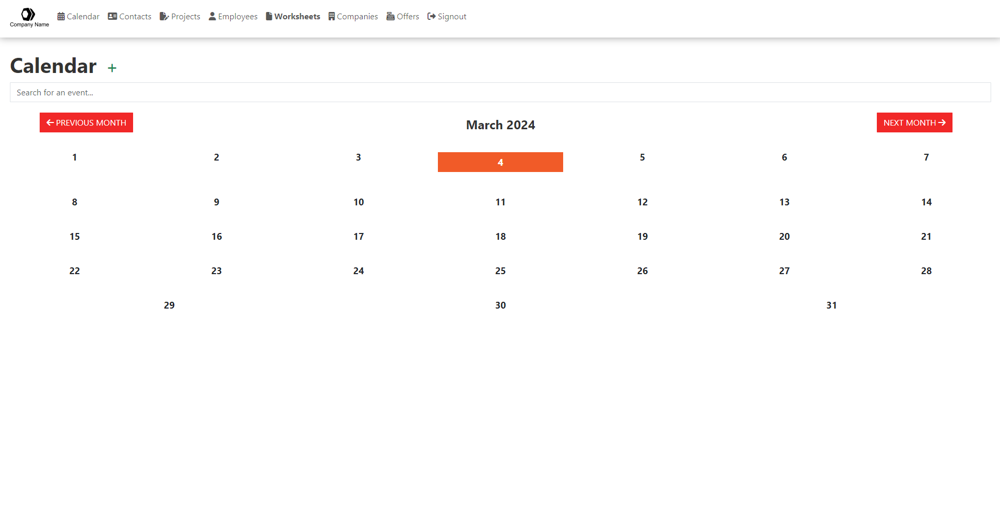

<p align="center">
    
</p>

# Simple ERP NodeJS

A Simple ERP system built in NodeJS express.

## How to use

### Clone & Install

Clone the repo and run the following command:
```
$ npm i
```

### SQL Database

You can set the database connection settings in the `config.js` file, at the `DB_INFO` attribute:
```js
...
module.exports = {
    DB_INFO: {
        host     : 'localhost',
        user     : 'root',
        password : '',
        port	 : 3306,
        database : 'simpleerpjs',
        multipleStatements: true
    },
    ...
```

Then run the whole `database.sql` file as an SQL command to setup the database.

### Start

You can just run:
```
npm start
```

Then visit the server at http://127.0.0.0:8080/
